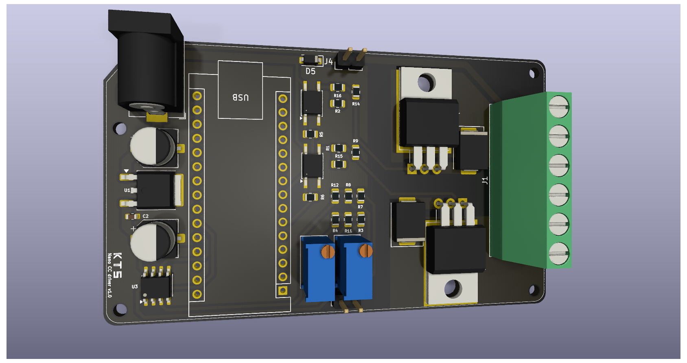

# Printed circuit board designs

A repository with **designs of printed circuit boards (PCBs)** for electronic circuits developed with KiCad. Each project has its own folder, focused on a different and specific problem.

The following projects are available:
- [full-bridge DC driver Arduino Nano (carrier board)](./arduino_nano_fullbridge_dc_driver)
- [low-side DC driver Arduino Nano (carrier board)](./arduino_nano_low_side_dc_driver)
- [relay module 5v optocoupler 4 channels](./relay_module_5v_optocoupler_4)
- [relay module 12v](./relay_module_12v_optocoupler)
- [relay module 12v SMT](./relay_module_12v_optocoupler_smt)
- [power supply with linear regulator 78xx](./power_supply_linear_regulator_78xx)
- [power supply with linear regulator lm317](./power_supply_linear_regulator_lm317)

## Arduino Nano full-bridge DC and sensor
Example of a PCB design to a carrier board for Arduino Nano with full-bridge circuit and voltage sensors.

    

## Arduino Nano low-side DC driver and sensor
Example of a PCB design to a carrier board for Arduino Nano with 2 low-side switches and voltage sensors.

    

## Relay module 3.3/5/12 V optocoupler 4 channels
Example of a PCB design to a four-channel relay module.

    

## Relay module 3.3/5/12 V optocoupler SMT
Example of a PCB design to a single-channel relay module with optocoupler.

    

## Premium version

This repository contains **open versions** which consider single-sided 1oz boards and Through-Hole Technology (THT) for components. Improved designs or boards using Surface Mount Technology (SMT) can be developed on request.

**Premium versions**, with additional features, extended documentation and support, are available at:  
👉 https://payhip.com/gkeiel 