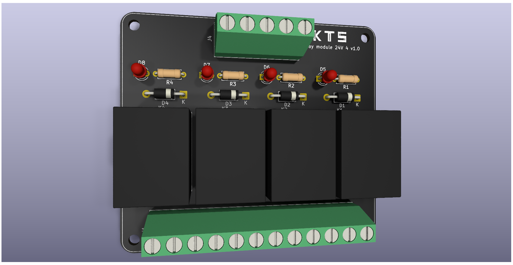
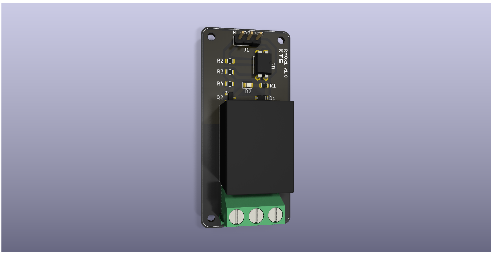
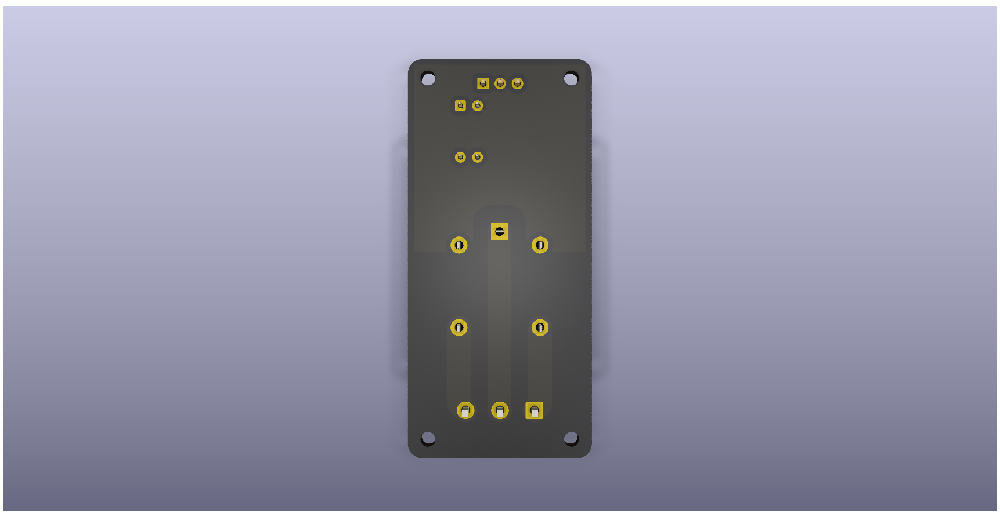

# Printed circuit board designs

A repository with **designs of printed circuit boards (PCBs)** for electronic circuits developed with KiCad. Each project has its own folder, focused on a specific problem.

The following projects are available:
- [relay module 24v 4 channels](./relay_module_24v_4) 
- [relay module 12v](./relay_module_12v_optocoupler)
- [relay module 12v SMT](./relay_module_12v_optocoupler_smt)
- [power supply with linear regulator 78xx](./power_supply_linear_regulator_78xx)
- [power supply with linear regulator lm317](./power_supply_linear_regulator_lm317)
- [Arduino Nano CC driver (carrier board)](./arduino_nano_cc_driver)

## Relay module 24V 4 channels
Example of a PCB design to a four-channel 24V relay module.

    
    

## Relay module 12V optocoupler SMT
Example of a PCB design to a single-channel 12V relay module with optocoupler.

    
    

## Arduino Nano continuous current (CC) driver and sensor
Example of a PCB design to a carrier board for Arduino Nano with PWM switches and sensor.

    

## Premium version

This repository contains **open versions** which consider single-sided 1oz boards and Through-Hole Technology (THT) for components. Improved designs or boards using Surface Mount Technology (SMT) can be developed on request.

**Premium versions**, with additional features, extended documentation and support, are available at:  
👉 https://payhip.com/gkeiel 