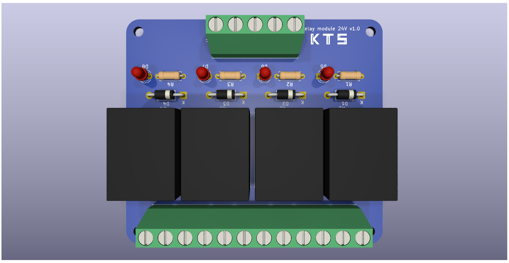
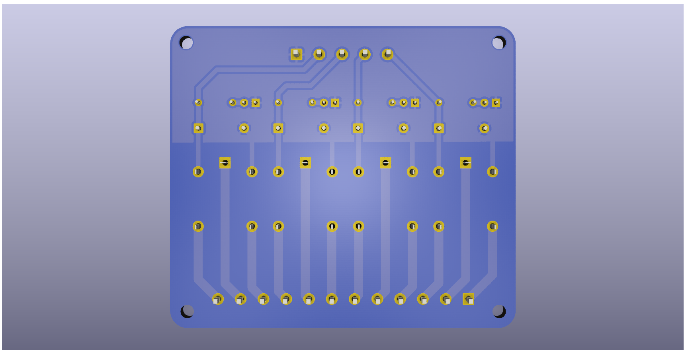
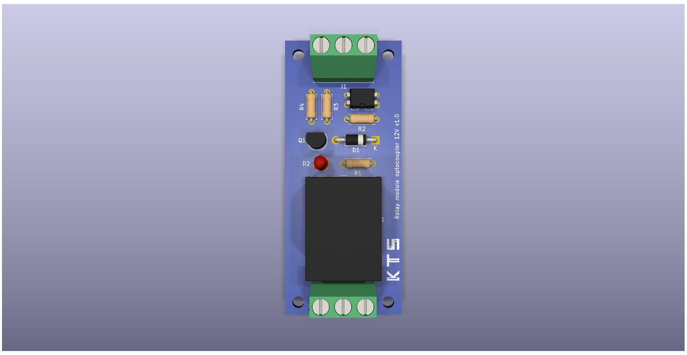
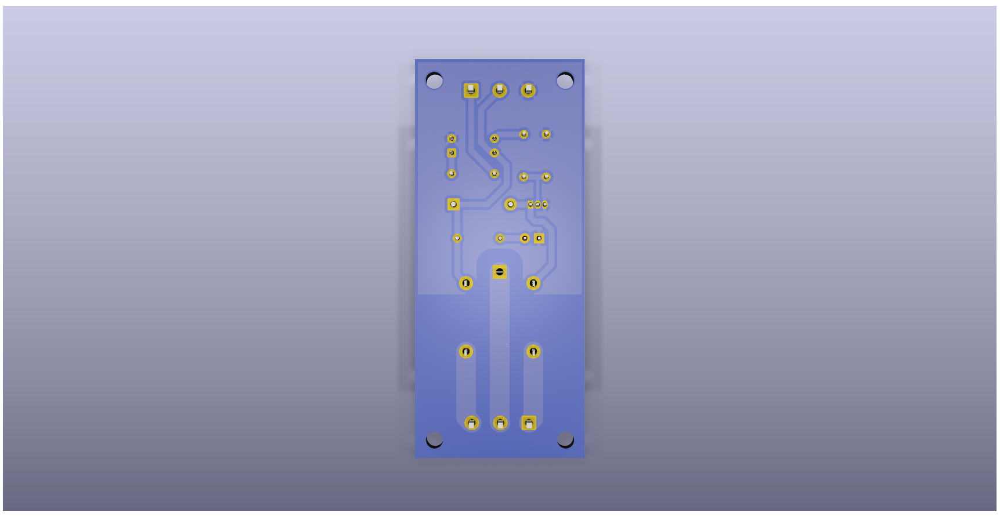

# Printed circuit board designs

A repository with designs of printed circuit boards (PCBs) for electronic circuits developed with KiCad. Each project has its own folder.

The following projects are available:
- [relay_module_24v](./open/relay_module_24v) 
- [relay_module_24v_4](./open/relay_module_24v_4) 
- [relay_module_12v](./relay_module_12v_optocoupler)
- [power supply with linear regulator 78xx](./open/power_supply_linear_regulator_78xx)
- [power supply with linear regulator lm317](./open/power_supply_linear_regulator_lm317)
- [arduino nano current driver (carrier board)](./open/arduino_nano_current_driver)

## Relay module 24V 4 channels
Example of a PCB design to a four-channel 24V relay module.

    
    

## Relay module 12V optocoupler
Example of a PCB design to a single-channel 12V relay module with optocoupler.

    
    

Most of these public projects consider single-sided 1oz boards and Through-Hole Technology (THT) for components. Improved designs or Surface Mount Technology (SMT) boards can be developed on request, commercially only.