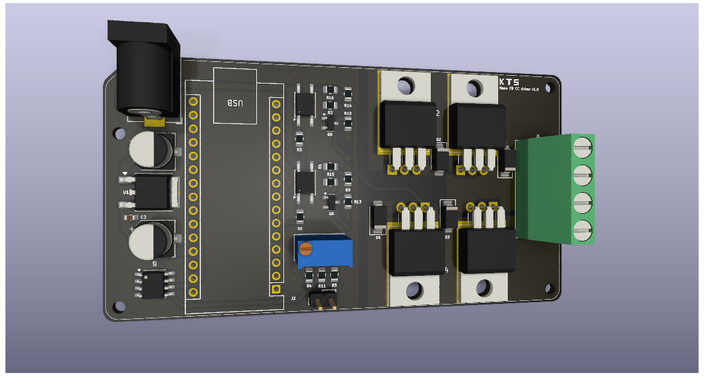
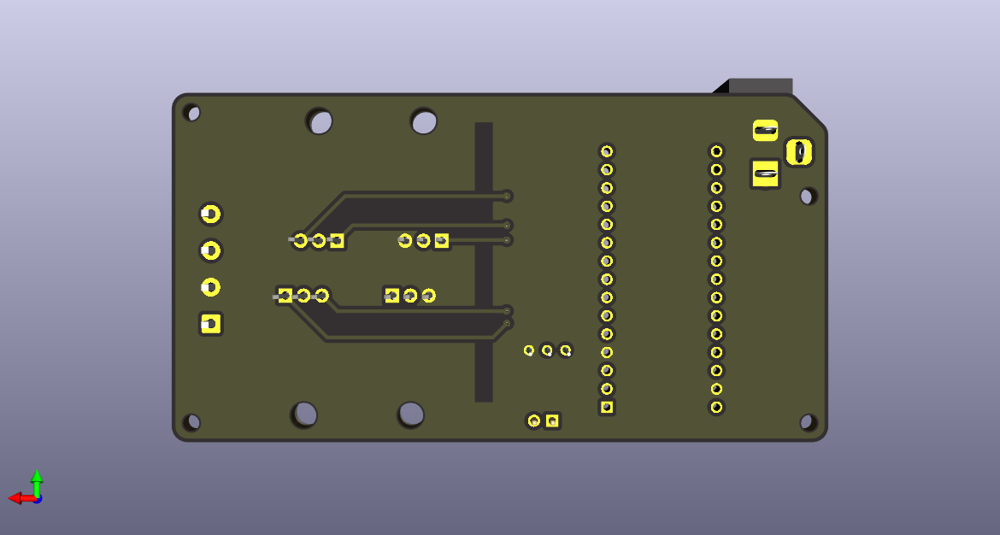

## Arduino Nano full-bridge DC driver and sensor

PCB design to a carrier board for Arduino Nano with full-bridge direct current (DC) driver using MOSFETs and adjustable voltage sensor.

    
    

